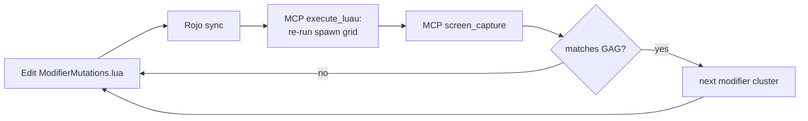

## Supersedes prior held-fish reduction plan

An earlier plan proposed **fewer** particles and a proximity zero-zone in `FishMutations.lua`. **This plan is the source of truth:** GAG reads as a **colored halo around the pet silhouette** (visible fill + ForceField aura shell + upward column), not mesh-only at distance. Revert or overwrite any pass-1 tuning in `ModifierMutations.lua` that set `fillT` to `0.88–0.95`, removed shells, and dropped particle rates to 3–4.

**Current branch:** `feat/gag-held-modifier-vfx` (uncommitted WIP). Either continue on this branch renamed in spirit to pass-2, or `feat/modifier-gag-fidelity-pass2` per git workflow — same work.

**False completions:** `verify-mcp` and `reference-modifier` were ticked without code changes. `golden` in repo still uses Foil + `fillT = 0.92` + rate 3 — **not** the reference pattern below. Execute those two todos first on implementation.

---

## Diagnosis (why pass 1 looked wrong)

Pass 1 dropped `Highlight.fillT` from `0.4` to `0.85–0.95` and removed aura shells. That made every modifier read as "lightly tinted fish" past 5 studs. Frozen survived because its visual is a **solid opaque ice cube wrap** (structural prop). Every other GAG mutation reads as **"colored halo around the silhouette of the pet"**.

From [GAG mutation reference video](https://youtu.be/ZtYiaZG_YQY):

- Golden: *"bathed in gold with a glowing aura around it"*
- Rainbow: *"a rainbow hovering above it"* + body color cycle
- Voidtouched: *"deep purple aura swirling around"*
- Zombified (= our `radioactive`): *"huge glowing radioactive green aura, dripping slime"*
- Shocked: *"bright saturated neon glow, full electric vibe"*

Unifying GAG element: **visible translucent colored halo** + thematic accents (rainbow arch, electric beams, swirl, sparkle column).

---

## Visual vocabulary (every non-Frozen modifier)

No new effect kinds — all primitives exist in [src/Shared/Util/FishMutations.lua](src/Shared/Util/FishMutations.lua):

1. **Aura shell** — `shell { shape="mesh", scale = 1.30–1.50, material = ForceField | Glass, transparency = 0.50–0.65, color = <theme> }`. Thin colored glow wrapping the silhouette.
2. **Visible fill highlight** — `highlight { outlineT = 0.05–0.15, fillT = 0.50–0.65 }`. Not pass-1 `0.88–0.95`, not original `0.4`.
3. **Modest PointLight** — `range = 6–10, brightness = 2.0–3.0`. Spill onto surfaces, not camera flood.
4. **Upward particle column** — `attachedParticle { emissionDirection = Top, spreadAngle = Vector2.new(20–40, 20–40), speed = NumberRange.new(3, 6), rate = 12–18, lifetime = NumberRange.new(1.0, 1.6) }`. Narrow cone rising from the pet.
5. **Beam accents** for signature mods — rainbow arch, crossing arcs (shocked/storm), swirl (voidtouched).

### Reference recipe — `golden` (implement in `reference-modifier`)

Replace current `M.golden` block with this structure (tune colors/rates via MCP screenshots):

```lua
M.golden = {
	{ kind = "materialLock", material = Enum.Material.Neon },
	{ kind = "tintLock",     color = Color3.fromRGB(255, 200, 40) },
	{ kind = "shell",        shape = "mesh", scale = 1.38,
		material = Enum.Material.ForceField, color = Color3.fromRGB(255, 210, 60),
		transparency = 0.58 },
	{ kind = "highlight",    outlineColor = Color3.fromRGB(255, 230, 110), outlineT = 0.1,
		fillColor = Color3.fromRGB(255, 215, 80), fillT = 0.58 },
	{ kind = "pointLight",   color = Color3.fromRGB(255, 210, 90), range = 8, brightness = 2.4 },
	{ kind = "attachedParticle",
		texture = SPARKLE_TEX,
		color   = ColorSequence.new(Color3.fromRGB(255, 245, 180), Color3.fromRGB(255, 200, 40)),
		rate     = 14,
		lifetime = NumberRange.new(1.0, 1.5),
		size     = NumberSequence.new({
			NumberSequenceKeypoint.new(0, 0),
			NumberSequenceKeypoint.new(0.25, 0.22),
			NumberSequenceKeypoint.new(1, 0),
		}),
		speed       = NumberRange.new(3, 5),
		spreadAngle = Vector2.new(28, 28),
		emissionDirection = Enum.NormalId.Top,
		acceleration = Vector3.new(0, 2, 0),
		lightEmission = 0.9,
	},
}
```

All other modifiers copy this **shell + fill + light + column** skeleton, then swap theme colors and add signature beams/fire/drips per table below.

---

## Per-modifier targets

**GAG-matched:**

| Modifier | Target |
|----------|--------|
| `rainbow` | Neon hueRotate (2.5s) + white ForceField shell + rainbow Beam arch + upward rainbow column |
| `golden` | Reference pattern above |
| `radioactive` | GAG Zombified — pulsing Neon green + large ForceField shell (scale 1.45) + downward slime drip + upward green column |
| `bloodlust` | GAG Bloodlit — red lerpLoop + red ForceField shell + Fire size 3 + red fill |
| `voidtouched` | Deep purple Neon + ForceField shell + 3 swirl Beams |
| `shocked` | Saturated yellow Neon + bright shell + 2 crossing Beams + upward spark column |
| `disco` | Flicker cycle (0.35s) + white ForceField shell + rainbow Beam arch |
| `dawn_blessed` | Warm Neon + warm ForceField shell + Fire size 3 + warm upward column |
| `tide_kissed` | Glass body + cyan ForceField shell + downward cyan droplets |
| `storm_forged` | Dark blue + 2 thin electric Beams + purple PointLight |

**Tides-original (GAG language, no 1:1 name):**

| Modifier | Target |
|----------|--------|
| `silver` | Foil + cool white ForceField shell + white sparkle column |
| `crystal` | Neon cyan + ForceField mesh shell (**not** cube) + shard column |
| `colossal` | Green + shell scale **1.5** + downward heavy motes |
| `tiny` | White Neon + shell scale **1.25** + quick small column |
| `ghostly` | transparency 0.5 + faint ForceField shell 1.3 + slow upward wisps |
| `ancientcore` | Sand + bronze ForceField shell + upward dust column |
| `moon_touched` | Silver Neon + Glass shell + silver column |
| `fog_shrouded` | Half-transparent + gray Glass shell + slow gray wisps |
| `inferno` | Orange Neon + orange ForceField shell + Fire size 4 + warm light |

**Untouched:** `frozen` (ice cube — user confirmed correct).

**Deprecated aliases** — point at rebuilt entries: `shiny`→`golden`, `giant`→`colossal`, `prismatic`→`rainbow`, `elder`→`voidtouched`, `cursed`→`bloodlust`, etc.

---

## Iteration loop (Studio MCP)



| Tool | Role |
|------|------|
| `list_roblox_studios` | Confirm active Studio (**verify-mcp**) |
| `screen_capture` | Baseline grid + per-mod comparisons |
| `execute_luau` | Re-run [scripts/Studio/CommandBar_SpawnModifierFish.luau](scripts/Studio/CommandBar_SpawnModifierFish.luau) |
| `inspect_instance` | Debug one broken mod's Highlight / shell / emitter |

Particle tuning references if columns look wrong: [xzZeP65SSlA](https://www.youtube.com/watch?v=xzZeP65SSlA), [jWD7YoV-FQw](https://www.youtube.com/watch?v=jWD7YoV-FQw).

**Source of truth:** disk edits via Cursor; Rojo syncs to Studio. Do not use MCP `multi_edit` on Studio scripts (desyncs git).

**Optional:** Add `CONFIG.HELD_PREVIEW = true` to spawn script so grid uses `heldProximity` + `HeldIntensity` for arm's-length checks — secondary to grid-at-5-studs pass.

---

## Engine considerations

**No edits** to [src/Shared/Util/FishMutations.lua](src/Shared/Util/FishMutations.lua) unless a blocker appears (e.g. shell merge bug). Existing order handles shell + highlight + light + particle + beam stacking. Reduced motion: particles/cycles off, shell + tint + highlight remain.

If held fish still white-outs after config rebuild, tune **rates/shell transparency** in `ModifierMutations` first; only then consider a small `GameConfig` cap change — not a new proximity system.

---

## Execution order (implementation)

1. **verify-mcp** — baseline screenshot (current grid before golden rebuild)
2. **reference-modifier** — golden recipe + screenshot loop until GAG match
3. **warm-cluster** → **vivid-cluster** → **cool-cluster** → **size-themed** → **deprecated**
4. **held-validate** — Play Solo hold fish (user's primary test path)
5. **final-screenshot** → **merge** (commits only when user requests)

---

## Git workflow

Per [CLAUDE.md](CLAUDE.md): finish on feature branch, commit per cluster when asked, merge to `main`, push, delete branch. Do not force-push.
